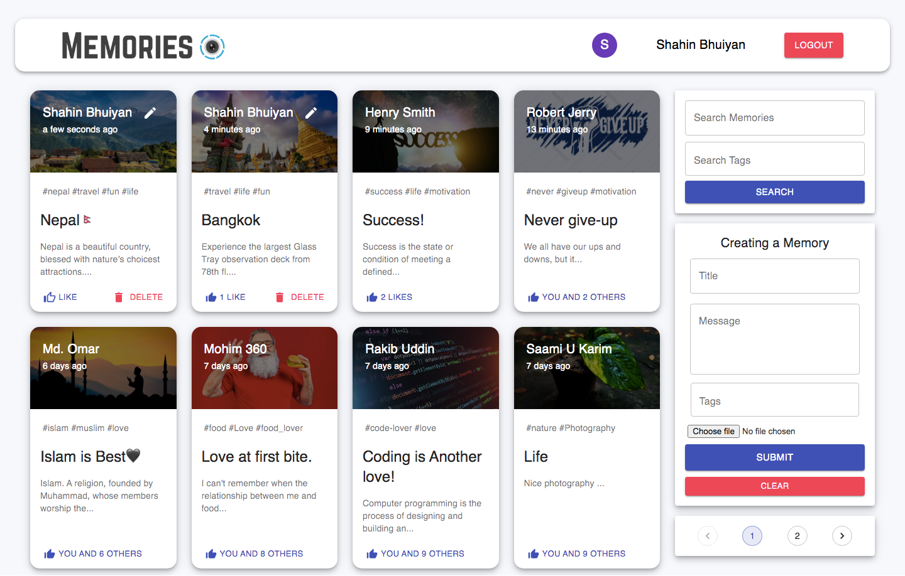

## Memories-client
#### An outstanding site where user can post his memory. Go & post your wonderful memory !!!

### Create your own memories [click here to explore](https://memories-sh.netlify.app/posts)

### Backend Repo [backend-code](https://github.com/ShahinurAlamBhuiyan/memories-server)

## Features: 
+ User can post his memory details with image. Like facebook !!!
+ User can edit and delete his posted memories whenever he wants.
+ One user can like and comment another user's memories.
+ By Clicking a post anyone can see the post description.
+ In post details page user also get related post.
+ User can search any post with tags or title name.
+ Login: 
      + To post memories user have to login first.
      + And user can't like any post if he don't logged In.

### Special-features:
+ If user logged in & don't use the site, then it will log out the loggedIn user automatically after 60 minutes.

## Technology:
+ Reactjs
+ React-redux
+ Redux-thunk
+ React-file-base64
+ momentjs
+ react-google-login
+ jsonwebtoken decode
+ axios
+ @material-ui
+ Skeleton.js

## Take a look 🥇 :)

